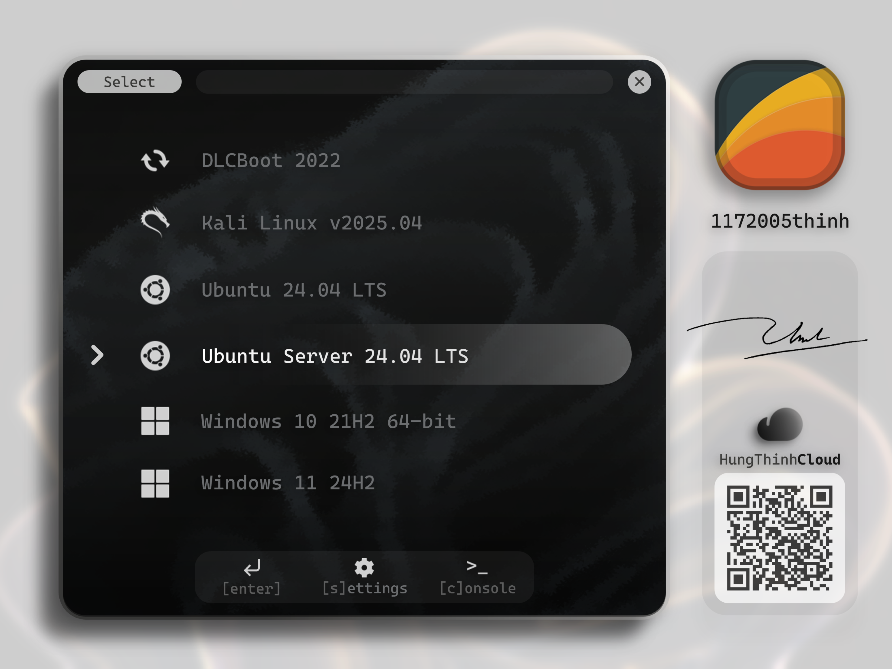

#  AUTOINSTALLER


`AutoInstaller` is a comprehensive automation solution for a fresh Windows installation with third-party apps, drivers and configurations.

<br clear="left"/>

## 💡 WHY AUTOINSTALLER?

> **Ever heard of `GHOST`?**

It is an "old school" solution to `clone` a machine to another one. A clone image might have Windows pre-installed, all the applications, drivers, and configurations you need. Easy to deploy, fast to restore, just a USB and you are good to go. However, if you are installing a fresh Windows from an shared image, think about it:

- How about the `hardware configuration` is not the same? The drivers might not be compatible with the new machine. Good luck with `BSOD`!
- Or, you don't like the idea of sharing a cloned OS with someone else? How about the `personalization`? How about the `privacy`? How about the `bloatware`? You may not want to share your custom configuration with others.
- Or, the `corrupted` image that includes a `funny virus/malware`? You might not know what has been added in the image. **Do you really trust the distributor?**

> **Here comes `AutoInstaller`**

Your machine, your own personalized Windows, softwares and configuration in your hand, fully installed with automation scripts.

## ✨ MAIN FEATURES

[AutoInstaller](https://github.com/1172005thinh/AutoInstaller) is a complete automation of fresh Windows installation, this tool provides:

1. **A custom bootable USB drive** with [Ventoy](https://www.ventoy.net/en/index.html) supporting:
    - A custom boot menu theme [ventoy/theme/1172005thinh](ventoy/theme/1172005thinh):

        | Dark Theme Preview | Light Theme Preview |
        | :---: | :---: |
        |  |  |

    - A custom Ventoy configuration [ventoy/ventoy.json.example](ventoy/ventoy.json.example) with pre-defined `Menu Alias`, `Menu Tips`, `Themes`, `Menu Class`, and `Auto-select` with [unattend scripts](Unattend):
        + **Menu Alias**: Replace the default image name with a custom name.
        + **Menu Tips**: Display a short description of the image.
        + **Themes**: Apply a custom theme to the boot menu with integrated [fonts](ventoy/font/cascadia-code).
        + **Menu Class**: To add [icons](ventoy/theme/1172005thinh/icons) to existing images.
        + **Unattend scripts**: Overall, these unattend scripts provides:
            + Installing Windows hands-off
            + Bypassing Windows 11 Hardware checks (TPM 2.0, Secure Boot, RAM, CPU, etc.)
            + Automatic/Manual disks, partitions selection/creation
            + Setting up Windows with your preferences (language, timezone, keyboard layout, etc.)
            + Creating a local user account
            + Disabling BitLocker
            + Remove bloatwares
            + And a lot more
        + About Ventoy Plugin, please refer to [Ventoy Plugin Docs](https://www.ventoy.net/en/plugin_entry.html) for more information.
2. **AutoInstaller scripts** for automatic apps/drivers installation and configuration after Windows installation:
    - `Auto-installer.exe`: Main entry point, provides the overall workflow of AutoInstaller.
    - `install-apps.exe`: Installing apps listed in `install-apps.ini`, a configuration file to define the apps to be installed.
        + `*/install_*.exe` is the mini-installer written for each app. **This tool does not work as a "magic" where it can install whatever you told it to.**
    - `install-drivers.exe`: Installing drivers using [SDIO](Drivers/README.md) and Windows Update as fallback. **Requires Internet connection**
    - `configure-windows.exe`: Configuring Windows settings defined under `configure-windows.ini`, a configuration file to tell what options should be enabled or disabled.
3. **Overall report and detailed logs** after installation:
    - The tool monitors the installation process and logs under `log_path` described in `install-apps.ini`.
    - A comprehensive `report.md` will also be generated at `log_path` for you to review the installation process.
    - However, some **Unattend scripts' logs** are stored in `C:\Windows\Setup\Scripts\*.log`, due to time limitations, I have not copied them to `log_path`. **Maybe in the future, I will.**

## 📁 PROJECT STRUCTURE

This repository is a `collection`, the source tree is not a representation of the folder structure of the bootable USB drive. **You need to manually copy the files to the bootable USB drive later**.

Overall, the tree looks like this:

> Note that some `*.md`, `.gitignore`, `mini-installer directories`, `.git` and `Docs` have been skipped for a better reading volume.

``` txt
AutoInstaller/
├── <mini-installers>                           <-- Mini-installer directories for each app
│   ├── *.ps1                                   <-- PowerShell helper script
│   └── install_*.au3                           <-- AutoIt script to install a specific app
├── Unattend
│   └── *.xml                                   <-- Unattend scripts for Windows installation
├── Docs                                        <-- Documentation
│   ├── REPO_STRUCTURE.md                       <-- Repository structure
│   ├── USB_STRUCTURE.md                        <-- USB structure
│   └── *.png                                   <-- Preview images
├── ventoy
│   ├── font
│   │   └── cascadia-code
│   │       └── *.pf2                           <-- Font files for Ventoy menu
│   ├── theme
│   │   ├── 1172005thinh
│   │   │   └── ...                             <-- Theme files for Ventoy menu
│   │   └── preview_*.png                       <-- Preview images for Ventoy menu
│   └── ventoy.*.json.example                   <-- Ventoy configuration example
├── .gitignore
├── compile-au2exe.ps1                          <-- PowerShell script to compile AutoIt scripts to executables
├── configure-windows.au3                       <-- AutoIt script to configure Windows
├── configure-windows.ini                       <-- Configuration file for configure-windows.au3
├── configure-windows.ps1                       <-- PowerShell script to configure Windows
├── extract.ps1                                 <-- PowerShell script to extract files
├── icon.ico                                    <-- Icon file for the tool
├── icon.png
├── install-apps.au3                            <-- AutoIt script to install applications
├── install-apps.ini                            <-- Configuration file for install-apps.au3
├── install-drivers.au3                         <-- AutoIt script to install drivers
├── install-drivers.ps1                         <-- PowerShell script to install drivers
├── report.au3                                  <-- AutoIt script to generate report
├── report.ps1                                  <-- PowerShell script to generate report
├── update_logs.ps1                             <-- PowerShell script to update logs
└── wallpaper.png                               <-- Example wallpaper image
```

For a detailed folder structure, please refer to [Repo Structure](Docs/REPO_STRUCTURE.md).

## 🚀 HOW TO BUILD YOUR OWN BOOTABLE USB DRIVE?

**NOTE THAT THIS IS THE INSTRUCTION FOR `WINDOWS` FOLKS ONLY**

### 📋 REQUIREMENTS

This repo depends on the following tools:

**MUST HAVE**

1. `AutoIt V3` compiler, please visit [official website](https://www.autoitscript.com/site/autoit/downloads/) or download the [latest version](https://www.autoitscript.com/files/autoit3/autoit-v3-setup.zip).
2. `PowerShell v5.0` scripting, please visit [official website](https://github.com/powershell/powershell) or download the [Microsoft Store installer](https://apps.microsoft.com/detail/9mz1snwt0n5d). Apparently, PowerShell is pre-installed in Windows 10/11. **NOTE**: You may need to install `.NET Runtime` accordingly as well.
3. `Ventoy` for a bootable USB, please visit [official website](https://www.ventoy.net/en/download.html) or download the version [1.1.17](https://sourceforge.net/projects/ventoy/files/v1.1.17). **NOTE**: Please check the SHA as this website is not underprovisioned.
4. A `16GB+` USB Flash Drive *(>= 16GB is recommended for storing Windows images, installer files and data)*. **NOTE**: Please ensure you have backed up all the data as this USB will be wiped completely.

**OPTIONAL**

1. `ffmpeg` for converting images into icons, please visit [official website](https://www.ffmpeg.org/download.html) or download the [latest version](https://github.com/BtbN/FFmpeg-Builds/releases/download/latest/ffmpeg-master-latest-win64-gpl-shared.zip).
2. `VMware Workstation Pro` for testing USB without the need of real hardware, please visit [official website](https://www.vmware.com/products/workstation-pro.html). **NOTE**: You have to signup a Broadcom account to get the installer.
3. `git` if you are interested in contributing to this project, please visit [official website](https://git-scm.com/downloads) or download the version [2.55.0.5](https://github.com/git-for-windows/git/releases/download/v2.55.0.windows.5/Git-2.55.0.5-64-bit.exe).
4. `vs-code` if you want to edit the source code more efficiently, please visit [official website](https://code.visualstudio.com/download).
5. `AI Agents` if you don't understand what the hecks I am writing. **However, the AI Agents are not guaranteed to provide a correct answer, so please double-check the answer.**

### 🛠️ STEP-BY-STEP

**1. 💾 PREPARING USB DRIVE WITH VENTOY**

Ensure you have Ventoy installed on you host machine, your USB drive is plugged in and all data is backed up:

1. Run `Ventoy2Disk.exe` from the extracted Ventoy folder with ` Administrator` privileges.
2. Click the dropdown menu `Device` to select your USB drive.
3. At the top left of the window, click `Option` menu > `Partition Configuration`, check `Preserve some space at the end of the disk` option, enter your desired `amount of free Gigabyte/Megabyte` *(recommended to be at least 10GB)*, click `OK` button at the bottom of the window to save.
4. Once Partition Configuration saved and closed, click `Install` button at the bottom to install Ventoy. You will be prompted to confirm the installation, click `Yes` to continue.
5. Once the installation has done, you will see the `three new partitions created` in File Explorer by Ventoy *(might be two as the other bootloader partition is hidden)*:
    
    ``` txt
    This PC/
    ├── ...                                     <-- Other disks and partitions
    ├── ISO/                                    <-- Typical ISO partition name created by Ventoy
    ├── USB/                                    <-- Remaining partition of the USB created by Ventoy
    └── VTOYEFI/                                <-- Hidden bootloader partition, no need to modify
    ```
    > *You may change the partitions' names according to your preference. This instruction assumes you are using the original partition names that came with Ventoy.*

6. Accessing the ISO and USB partition and create files and folders to be as follow:

    ``` txt
    ISO/
    ├── Windows                                 
    │   └── Windows11                           <-- Windows ISO files stored here
    └── 5b512ee8a59deb284ad0a6a035ba10b1.md5    <-- Important flag, do not delete

    USB/
    └── aea541d7f9574587656dc5125116e548.md5    <-- Important flag, do not delete
    ```
    > *The MD5 flag file is a hash for identification. Removing it will cause issues.*

**2. 💽 COPYING THE ISO FILES**

Please copy your desired original Windows ISO file to the ISO partition of the USB drive:

1. Download the official Windows 11 ISO from [Microsoft's website](https://www.microsoft.com/software-download/windows11).
2. Moving that ISO file to `ISO/Windows` folder created in the previous step:

    ``` txt
    ISO/
    ├── Windows
    │   └── Windows11
    │       └── w11.iso                         <-- Copied Windows ISO file
    ├── ArchLinux
    │   └── archlinux.iso                       <-- Copied ArchLinux ISO file
    └── 5b512ee8a59deb284ad0a6a035ba10b1.md5
    ```    
    *Optional: You may add other ISO images, e.g. `ArchLinux`, `Ubuntu`, to the `ISO/` partition as needed.*
    > *The ISO filename can be renamed however you like, but it might require to update the `ventoy.json` file. I recommend to rename it as above.*

**3. 📦 CLONING THIS REPOSITORY**

You have to download or clone this repository from GitHub by either:

1. Download [this ZIP file](https://github.com/1172005thinh/AutoInstaller/archive/refs/heads/dev.zip), then extract it to a directory (not on your USB partition) on your computer.
2. Manually download the ZIP file by navigating to [this repository](https://github.com/1172005thinh/AutoInstaller), click `Code` button, and then click `Download ZIP`, then extract it to a directory (not on your USB partition) on your computer.
3. For `command-line` folks, you can clone this repo by:

    ``` bash
    git clone https://github.com/1172005thinh/AutoInstaller.git
    ```

**4. ⚡ COPYING REPO FILES TO USB**

This repo includes a script `extract.ps1` to automatically compile source code into executables, copy the required files from the repo to the USB partitions:

1. Open `PowerShell` as administrator in the extracted repo directory.
2. *(Optional)* If you encounter a script execution policy error (`PSSecurityException` / `not digitally signed`), unblock the scripts or allow script execution for the current session:

    ``` powershell
    # Temporarily allow script execution in current PowerShell session:
    Set-ExecutionPolicy -Scope Process -ExecutionPolicy Bypass

    # Or unblock all extracted files if downloaded as a ZIP from GitHub:
    Get-ChildItem -Recurse | Unblock-File
    ```

3. Run this command:
    
    ``` powershell
    .\extract.ps1
    # Or run directly with one-shot policy bypass:
    powershell -ExecutionPolicy Bypass -File .\extract.ps1
    ```
    > *This command will automatically identify the ISO and USB partitions, and copy the required files from the repo to the USB partitions. Please view the output to make sure there are no errors.*

    *You may refer to tell where are the ISO and USB partitions by this command:*
    ``` powershell
    .\extract.ps1 -i I:S
    ```
    > *Where I and S are the label of ISO partition and USB partition respectively.*

    *For a safe simulation, you might want to try:*

    ``` powershell
    .\extract.ps1 --dry-run
    ```
    > *This command will not copy any files to the USB partitions, but it will show you the expected output of the command.*

    *Once ran, you may also refer to `extract.log` to verify the output.*

**5. 📥 DOWNLOADING SETUP FILES**

This repo does not ship any binary executables, all the required `setup_file` should be manually downloaded by the users. Please refer to [install-apps.ini](install-apps.ini) to modify the list of apps you want to install.

1. Download URL of each setup file supported in this current version:

    > *Note that `only 64-bit versions` are supported. `URL might be 404` due to version update*. You `DOES NOT NEED` to download all, just the ones you want to install.
    
    | Index | `setup_file` | `download_url` |
    |---|---|---|
    | 0 | Browsers/chrome-standalone.exe | [Google Chrome Standalone](https://www.google.com/chrome/eula.html?standalone=1) |
    | 1 | Environment/Java/java.exe | [Java Runtime 8u503](https://javadl.oracle.com/webapps/download/AutoDL?BundleId=253608_2fde65a2208f40a5b5f4c844b0dff092) |
    | 2 | Environment/Python/python.exe | [Python 3.14.7](https://www.python.org/ftp/python/3.14.7/python-3.14.7-amd64.exe) |
    | 3 | Environment/VCRedist/vcredist-AIO.exe | [VCRedist AIO 2005-2026](https://github.com/abbodi1406/vcredist/releases/download/v0.105.0/VisualCppRedist_AIO_x86_x64.exe) |
    | 4 | Environment/IDEs/vs.exe | [VS 2026 Community](https://visualstudio.microsoft.com/thank-you-downloading-visual-studio/?sku=Community&channel=Stable&version=VS18&source=VSLandingPage&cid=2500&passive=false) |
    | 5 | Tools/Archivers/7z.exe | [7z 26.02](https://github.com/ip7z/7zip/releases/download/26.02/7z2602-x64.exe) |
    | 6 | Tools/Archivers/winrar.exe | [WinRAR 723](https://www.win-rar.com/fileadmin/winrar-versions/winrar/winrar-x64-723.exe) |
    | 7 | Tools/Editors/notepadpp.exe | [Notepad++ 8.9.8](https://github.com/notepad-plus-plus/notepad-plus-plus/releases/download/v8.9.8/npp.8.9.8.Installer.x64.exe) |
    | 8 | Tools/Editors/vscode.exe | [VSCode 1.134](https://code.visualstudio.com/download?_exp_download=fb315fc982#) |
    | 9 | Utilities/MediaPlayers/mpc.exe | [MPC Mega 1995](https://files2.codecguide.com/K-Lite_Codec_Pack_1995_Mega.exe) |
    | 10 | Utilities/MediaPlayers/potplayer.exe | [PotPlayer Latest Version](https://t1.kakaocdn.net/potplayer/PotPlayer/Version/Latest/PotPlayerSetup64.exe) |
    | 11 | Utilities/MediaPlayers/vlc.exe | [VLC 3.0.23](https://get.videolan.org/vlc/3.0.23/win64/vlc-3.0.23-win64.exe) |
    | 12 | Utilities/VietnameseKeyboards/unikey.exe | [Unikey 4.6RC2](https://www.unikey.org/assets/release/unikey46RC2-230919-win64.zip) |
    | 13 | Tools/ScreenRecorders/obs.exe | [OBS Studio 32.2.2](https://cdn-fastly.obsproject.com/downloads/OBS-Studio-32.2.2-Windows-x64-Installer.exe) |
    | 14 | Tools/DesktopSupporters/ultraviewer.exe | [UltraViewer vi 6.6.133](https://dl2.ultraviewer.net/UltraViewer_setup_6.6.133_vi.exe) |
    | 15 | Tools/DesktopSupporters/teamviewer.exe | [TeamViewer Latest Version](https://download.teamviewer.com/download/TeamViewer_Setup_x64.exe) |
    | 16 | Office/Office2024/office2024.exe | [Office 2024 Deployment Tool](https://download.microsoft.com/download/6c1eeb25-cf8b-41d9-8d0d-cc1dbc032140/officedeploymenttool_20228-20124.exe) *Refer to [ODT Setup](Office/Office2024/README.md)* |
    | 17 | Office/LibreOffice/libreoffice.msi | [LibreOffice 26.2.5](https://download.documentfoundation.org/libreoffice/stable/26.2.5/win/x86_64/LibreOffice_26.2.5_Win_x86-64.msi) |
    | 18 | Tools/Torrents/qbittorrent.exe | [qBittorrent Latest Version](https://sourceforge.net/projects/qbittorrent/files/latest/download) |
    | 19 | Socials/discord.exe | [Discord Latest Version](https://discord.com/api/downloads/distributions/app/installers/latest?channel=stable&platform=win&arch=x64) |
    | 20 | Socials/zalo.exe | [Zalo Latest Version](https://zalo.me/download/zalo-pc?utm=90000) |
    | 21 | Antivirus/kaspersky.exe | [Kaspersky Latest Version](https://www.kaspersky.com.vn/downloads/antivirus) |
    | 22 | Utilities/FileExplorer/shell.msi | [NileSoft Shell 1.9.18](https://nilesoft.org/download/shell/1.9.18/setup-x64.msi) |
    | 23 | Utilities/Fonts | [HungThinhCloud Shared Fonts](https://drive.hungthinhcloud.freeddns.org/share/yZzCuQ9e/Fonts/) |

    > *This is painfully slow, I know. I'm working on a solution. Please stay tuned.*

2. Modifying `install-apps.ini` to match your needs.

    ``` ini
    # EXAMPLE CONFIGURATION
        ## All targets can be indexed in this file, but not all indexed targets will be installed/desktop-shortcuted    
    target=[
        # index,setup_file,install_file,install_flag,desktop_shortcut_flag
        # `index`: indexing of the target, not indexed won't be added to installation, duplicated indexing throws error
        # `setup_file`: relative path to the setup file
            ## You may name it as you whatever you want, install file will get the exact name of setup file.
        # `install_file`: relative path to the installation script
            ## Can not rename, must be compiled with `compile-au2exe.ps1`
        # `install_flag`: whether the installation will be installed
            ## `true`: Install the application
            ## `false`: Do not install the application
        # `desktop_shortcut_flag:` whether the desktop shortcut will be created
            ## `true`: Create desktop shortcut
            ## `false`: Do not create desktop shortcut
        # Example:
        0,"Browsers/chrome-standalone.exe","Browsers/install_chrome-standalone.exe", true,true;
        # You might have multiple versions of Java Runtime stored in the folder Environment/Java/, e.g. `java-8u441.exe`, `java-8u503.exe`. Let's install the 8u441:
        1,"Environment/Java/java-8u441.exe","Environment/Java/install_java.exe",true, false;
        # Renaming files? If you are too lazy, just leave it as it is. Welp, but then you have to modify this configuration. So just do what you want. 
        2,"Environment/Python/python-3.14.7-amd64.exe","Environment/Python/install_python.exe",true,false;
        # The install file can run independently of this script with a local default setup filename (read the source code to know). If the default setup filename could not be found or not parsed correctly, it terminated with error. For instance, the default setup file of `install_vcredist.exe` is `vcredist-AIO.exe`. It is recommended to keep a setup file named as same as the default filename.
        3,"Environment/VCRedist/vcredist-AIO.exe","Environment/VCRedist/install_vcredist.exe",true,false;
        # Fonts: Just copy the desired font files to `Utilities/Fonts/` directory, the script will automatically get the fonts to install them. Note that if `clean_after_installation` is `true`, then the invalid/uninstallable/already-installed fonts will be removed after installation
        4,"Utilities/Fonts","Utilities/Fonts/install_fonts.exe",true,false;
    ];
    ```

**6. ⚙️ CUSTOM WINDOWS CONFIGURATION**

This is the easiest part as you just need to modify the options in [configure-windows.ini](configure-windows.ini) carefully.

**7. ✅ VALIDATION**

Please have a look at [USB Structure](Docs/USB_STRUCTURE.md) to verify if your USB has been set up properly.

## 🔮 INCOMING FEATURES

This is a scratchpad for incoming features, not all of them will be implemented:

1. **AUTO DOWNLOAD THE SETUP FILES WITH ADVANCED install-apps.ini**
2. **GUI APPLICATION FOR EDITING THE INI FILES, COMPILING AND COPYING TO USB**

## ⚠️ KNOWN ISSUES

1. **LOG INCONSISTENT PATHS**: Some log are not stored under a central path but split across multiple locations which makes it hard to track the logs.
    - *Expected*: All logs gathered under a single pred-defined path `log_path`.
    - *Got*: Unattend PowerShell scripts log in `C:\Windows\Setup\Scripts\*.log`
    - *Uncontrollable*: Unattend XML Windows installation log in `C:\Windows\Panther\`
2. **CONFIGURE-WINDOWS FAILED ON SOME SETTINGS**: Currently, the configure-windows process might fail completely/partially to apply the below settings:
    - `Taskbar Pins Removal`: *Expected* to remove all pins, *Got* removed some only.
    - `Taskbar Pins Add`: *Expected* to add listed apps, *Got* nothing added.
    - `Start Menu Pins Removal`: *Expected* to remove all pins, *Got* nothing removed.
    - `Start Menu Pins Add`: *Expected* to add listed pins, *Got* nothing added.
    - `Start Menu Folder`: *Expected* to add listed folders, *Got* nothing added.
3. **PAINFULLY SLOW GETTING SETUP FILES DOWNLOADED**: The process of downloading all the setup files takes too much effort to manually do it.
    - `Suggestion`: Modify `install-apps.ini` to now include the `download URL` of each setup file and create a new script `download-apps.ps1` to automatically download all the setup files. **Not guaranteed to work for all apps due to anti-bot/credentials issues**
4. **WINRAR DESKTOP SHORTCUT NOT CREATED**: Currently, even if the `desktop_shortcut_flag` is true, WinRAR failed to add its shortcut to the desktop.
    - *Expected*: A desktop shortcut for WinRAR will be created at `C:\Users\Public\Desktop\WinRAR.lnk`
    - *Got*: Nothing created.
    - *Current workaround*: Manually create the desktop shortcut.
5. **SDIO DRIVER INSTALLATION UNSTABLE**: Currently, the SDIO driver installation process might fail completely/partially to detect and install all the required drivers accordingly.
    - *Expected*: Silently detect and install all required drivers.
    - *Got*: UAC prompted during the installation asking for public and private network access. Althought the installation will still proceed and finish installing no matter the UAC prompt. However, by selecting `Yes` to the UAC within the first 60 seconds after launching SDIO, it kills the process.
    - *Workaround*: Do not select `Yes` or interact with the UAC prompt at the first 60 seconds. After 60 seconds, the UAC prompt can be interacted.
6. **UNIKEY GUI CONFIGURATION DOES NOT WORK**: Currently, the UniKey configuration via GUI does not apply after running the script. The script successfully creates the registry key, but the GUI settings are not synced properly.
    - *Expected*: The UniKey configuration via GUI should be synced with Registry key.
    - *Got*: Unexpected behaviour of toggling the configuration.
    - *Workaround*: Open Registry Editor and manually configure the UniKey settings.
7. **POTPLAYER DESKTOP SHORTCUT NOT CREATED**: Currently, even if the `desktop_shortcut_flag` is true, PotPlayer failed to add its shortcut to the desktop.
    - *Expected*: A desktop shortcut for PotPlayer will be created at `C:\Users\Public\Desktop\PotPlayer.lnk`
    - *Got*: Nothing created.
    - *Current workaround*: Manually create the desktop shortcut.

## 📚 REFERENCES

- [Unattend Generator Schneegans.de](https://schneegans.de/windows/unattend-generator/)
- [Microsoft Autounattend](https://learn.microsoft.com/en-us/windows-hardware/customize/desktop/unattend/)
- [GRUB2 Theme Icons](https://www.gnome-look.org/p/2206122)
- [Cascadia-Code Fonts](https://fonts.google.com/specimen/Cascadia+Code)
- [AutoIt Scripts](https://www.autoitscript.com/wiki/)

## 📄 LICENSE

Please refer to [LICENSE.md](LICENSE.md) for more information.

## 🤝 CONTRIBUTION

This is a `hobby project`, I am the only developer and I am still in school so I can not promise to update the tools regularly. It is my own decision to maintain or discontinue this project at any time.

**Author: `1172005thinh`** 

- `Hung Thinh Nguyen` [GitHub](https://github.com/1172005thinh)
- `Nguyễn Hưng Thịnh` [Facebook](https://www.facebook.com/quickcomp.hungthinhnguyen)
- `HungThinhCloud` [Public Profile](https://hungthinhcloud.freeddns.org/about/)

**Contributors: `AI Agents`**

- `Claude - Anthropic` - Master reasoning
- `Codex - OpenAI` - Coder
- `Gemini - Google` - Researching and validation testing

---

## 📝 UPDATE STATUS

> Version: 0.1.2

| **Last Updated** | **Date** | **Description** |
|---|---|---|
| [*This README.md*](README.md) |  | Update [Known Issues](#known-issues) and fix typos |
| [*Antivirus*](Antivirus/) |  | |
| [*Browsers*](Browsers/) |  | |
| [*IDEs*](Environment/IDEs/) |  | |
| [*Java*](Environment/Java/) |  | |
| [*Python*](Environment/Python/) |  | |
| [*VCRedist*](Environment/VCRedist/) |  | |
| [*LibreOffice*](Office/LibreOffice/) |  | |
| [*Office2024*](Office/Office2024/) |  | |
| [*Socials*](Socials/) |  | |
| [*Archivers*](Tools/Archivers/) |  | |
| [*DesktopSupporters*](Tools/DesktopSupporters/) |  | |
| [*Editors*](Tools/Editors/) |  | |
| [*ScreenRecorders*](Tools/ScreenRecorders/) |  | |
| [*Torrents*](Tools/Torrents/) |  | Add `qBittorrent` |
| [*FileExplorer*](Utilities/FileExplorer/) |  | |
| [*Fonts*](Utilities/Fonts/) |  | |
| [*MediaPlayers*](Utilities/MediaPlayers/) |  | Add `PotPlayer`, `VLC` |
| [*VietnameseKeyboards*](Utilities/VietnameseKeyboards/) |  | |

